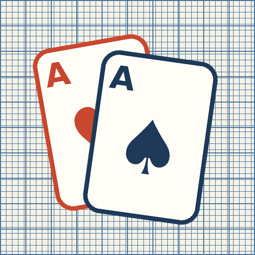

# 方眼ソリティア

つくる手帖のソリティア(クロンダイク)。方眼紙の上でカードを組み上げていく、一人でじっくり遊べるゲームです。

**▶ あそぶ: https://tad551216-rgb.github.io/solitaire/**

## あそびかた

- **タップ** — カードに触れると、置ける場所へ自動で移動します(組札 → 場札の順に判断)
- **ドラッグ** — カードをつかんで運ぶこともできます。連なった列は先頭カードをつかむとまとめて動きます
- **山札** — タップで1枚めくり。「めくり: 1枚 / 3枚」で難易度を切り替えられます
- **ヒント** — 次の一手を朱色の枠で教えてくれます
- **戻す** — 何手でもアンドゥできます
- **自動でそろえる** — 全カードが表向きになると出現し、残りを自動で組札へ運びます

## ホーム画面に追加(PWA)

SafariやChromeの「共有」→「ホーム画面に追加」で、アプリとしてインストールできます。一度開けばオフラインでも遊べます。

## つくりのこと

つくる手帖の道具はすべて同じ考えかたで作っています。

- **単一HTMLファイル** — index.html ひとつで完結。ライブラリもビルドも不要
- **サーバーなし・外部送信なし** — 遊んだ記録はどこにも送られません
- **オフラインファースト** — Service Worker(キャッシュファースト)で通信のない場所でも動きます
- **方眼紙のデザイン** — 生成りの紙に藍と朱。フォントは端末の標準のみ

| ファイル | 役割 |
|---|---|
| `index.html` | ゲーム本体(HTML/CSS/JSすべて) |
| `manifest.json` | PWAマニフェスト |
| `sw.js` | Service Worker(キャッシュ名 `hougan-solitaire-v1`) |
| `icon-*.png` / `apple-touch-icon.png` | アイコン一式 |

### 更新するとき

`index.html` を変更したら、`sw.js` の `CACHE` を `hougan-solitaire-v2` のように一つ上げてください。インストール済みの端末にも確実に反映されます。

## つくる手帖について

「つくりたい人が、自分の道具を自分でつくる」ための実例集です。ほかの道具やあそびは [余白](https://tad551216-rgb.github.io/tsukuru-techo/yohaku.html) からどうぞ。
